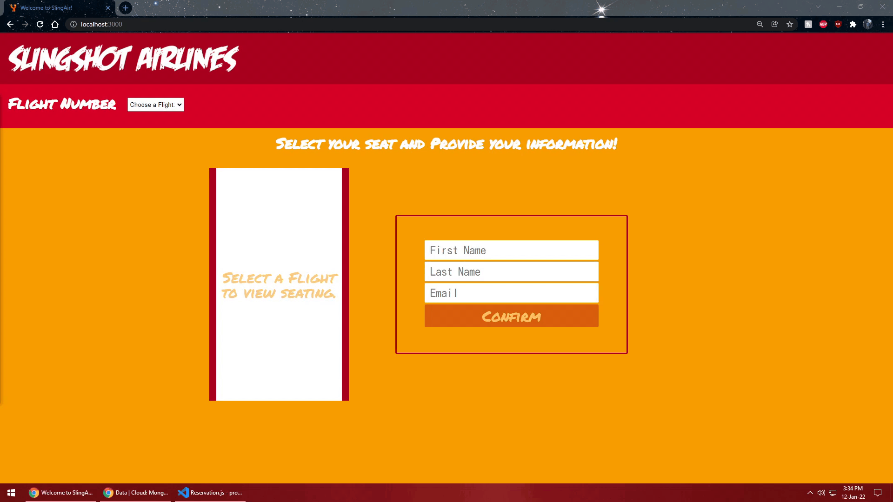
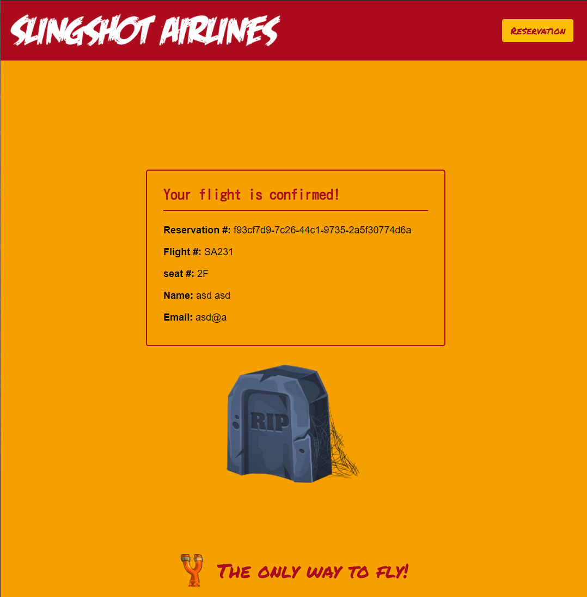
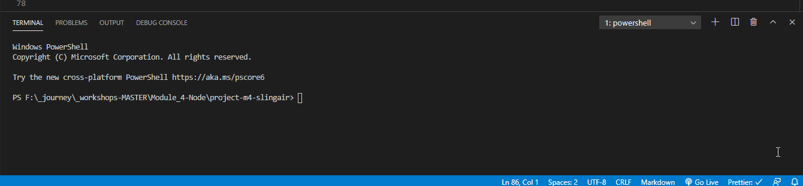

# Node.JS Project: SlingAir!


You just accepted the full-stack developer position at Slingshot Airlines!

They were really impressed with the work you did at Concordia Bootcamps. After a conversation with the CEO at the job fair, they hired you on the spot! They have project that they need to ship ASAP and are confident that you can deliver.

They have a new seat-booking app that is set to be released in 3 days! You were told that _most_ of the work is already done, and that all that remains is to connect the different pieces to get it working.

You have been provided with a GitHub repo and little else.

When you asked if it was possible to speak to the dev that worked on the project before you came aboard, you are told "Nope. Not possible. He left without notice and on bad terms."

Looks like you're on your own...



---

## The App

### Screenshots




---

## Setup

Add the `proxy` into the `client`'s `package.json` file:

```json
    "proxy": "http://localhost:8000"
```

### Functionality

- When a user navigates to `http://localhost:3000`, they are presented with a dropdown to select the flight number.
- With the flight number, make a request to the server for the seating availability on that flight.
- When a response with seating is received, display the seating input as well as the form requesting user's information.
- User selects a seat, enters information and clicks 'Confirm'.
- Contact the server with the data, and wait for a success response to redirect to the `/confirmation` page.
- The confirmation page should display a confirmation message to the user with the info that they entered on the previous screen.
- Consider using `localStorage` to save the reservation id, to allow for retrieval if the user closes and reopens the browser at `/reservation`.

---

## Project Setup

### The Frontend

> The frontend has already been completed, although the FE will be covered after this project in detail, but my advice is to look inside the service folder in order to create the necessary uri's for your BE!

1. Open a terminal in VS Code
2. Type `cd frontend`
3. Type `yarn install`

Use `yarn dev:frontend` to start the frontend dev environment.

### The Backend

1. Open _another_ terminal in VS Code
2. Type `cd backend`
3. Type `yarn install`

Use `yarn dev:backend` to start the backend dev environment.



## Developer Notes

There is a folder called `notes` that contains possible hints on what to do next...

---

## Requirements for Project Completion

In order for your project to be considered `DONE` (passing grade), you should have a working MVP of the app.

---

### Backend

1. Server endpoints are RESTful.
2. There are endpoints for the following actions:

   - Retrieve all flight numbers.
     - Should respond with an array of the flight numbers.
   - Retrieve single flight data.
     - Should respond with an array of seating information.
   - Retrieve all reservations.
     - **_Must work through Insomnia._**
   - Retrieve a single reservation.
   - Create a reservation.
     - Needs to insert a document into the `reservations` collection.
     - Needs to modify a document in the `flights` collection.
     - Should respond with the \_id that was created.
   - Delete a reservation.
     - Needs to modify or delete a document in the `reservations` collection.
     - Needs to modify a document in the `flights` collection.
     - **_Must work through Insomnia._**
   - Update a reservation.

     - Needs to modify a document in the `reservations` collection.
     - Needs to modify a document in the `flights` collection.
     - **REQUIRED: Change the seat number (don't forget to make the old seat available).**

     - **_Must work through Insomnia._**

3. Server should respond in a _complete_ fashion:
   - Send the status and the `json` separately.
   - Send the status in the `json` object as well.
   - When a request succeeds respond with `the requested data`.
   - When a request fails, respond with `the data that was sent to the server`. _This makes it easier for FE developers to debug their code._
   - When a request does not need any data to be returned, provide a message explaining the status: i.e. "reservation deleted."

```js
res.status(200).json({ status: 200, data: {}, message: "" });
```

---

### Frontend

These are functionalities that will be visible to you once the backend is completed

1. User can select a flight from a dropdown.
2. User can select an available seat.
3. User can enter their personal information.
4. User can view the flight confirmation page after booking a seat.
   - The confirmation page should `fetch` the details of the reservation from the backend based on it's unique `id`.
5. The reservation button in the header should only appear once a reservation has been made.
6. The reservation page should `fetch` the details of the most recent reservation from the backend based on it's unique `id`.

---

### Database Integration: MongoDB

Migrate the data in `backend/data.js` to a brand-new MongoDB database.

In order to incorporate the Database, you will need to setup your backend as it will not use the data in `data.js`, but will use the database to complete all of the requests it receives from the frontend.

**_Recommended structure_:** (for flights collection)

```js
{
    _id: "SA231",
    flight: "SA231",
    seats: [{...}, {...}, {...}, ...]
}
```


